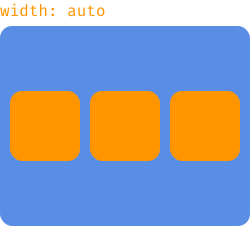

# Size

The `size` of a view is controlled by the `width` and `height` properties, and can be specified using pixels, a percentage, a stretch factor, or auto.

## Fixed Size (Pixels)

The width and height of a view can be specified with a number of logical pixels. In this case changes to the size of the parent view, or to the children of the view, will have no effect on its size.


## Percentage Size

The width and height of a view can also be specified as a percentage of the parent view size.


## Stretch Size

The width and height of a view can also be specified with a stretch factor, which will cause the view to fill a proportion of the free space.


For example, given the following code:

```rust
HStack::new(cx, |cx|{
    Label::new(cx, "Hello")
        .background_color(Color::gray())
        .width(Stretch(1.0));

    Label::new(cx, "World")
        .width(Stretch(2.0));
});
```

The first label occupies 1/3 of the horizontal space and the second occupies 2/3 of the free space.

The free space is the size of the parent in the main axis (width for row, height for column) minus any fixed space/size. 

## Auto Size (Hug)

The width and height of a view can be specified as `auto`, which results in the view 'hugging' its children in the specified axis.



For example, given the following code:

```rust
HStack::new(cx, |cx|{
    Label::new(cx, "Hello");
    Label::new(cx, "World");
})
.height(Auto);
```

The height of the `HStack` is specified as `Auto`, which causes the computed height to become the maximum of its child heights.

If we had specified the hstack width to be `Auto`, then the computed width would be the sum of the widths of its children.

## 

The `width` and `height` of a view can be specified using the respective layout modifiers which use the `Units` type:

```rust
Label::new(cx, "Hello World")
    .background_color(Color::gray())
    .width(Pixels(200.0))
    .height(Pixels(30.0));
```

The width and height can also be set simultaneously with the `size` layout modifier:

```rust
Label::new(cx, "Hello World")
    .background_color(Color::gray())
    .size(Pixels(50.0));
```

Or in CSS:

```css
.hello_label {
    width: 20px;
    height: 1s;
}
```