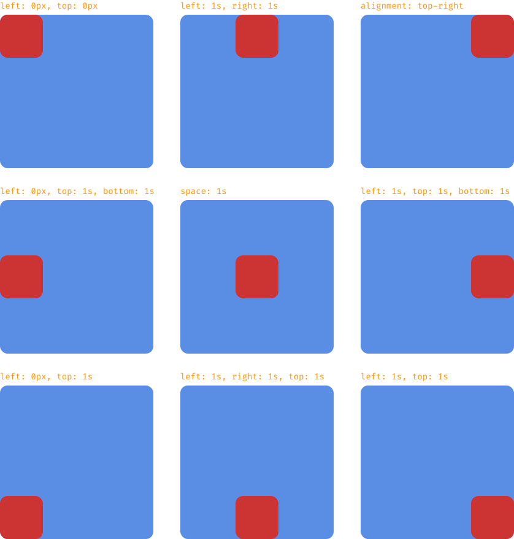

# Spacing

Spacing applies only to children with a position type of absolute, and is specified using the `left`, `right`, `top`, and `bottom` properties, or the `space` property as a shorthand. Each of these properties can have a value in pixels, a percentage, or a stretch factor.

A combination of pixels and stretch spacing can be used to align a view within its parent. For example, stretch factors can be used to center a view by applying equal stretch factors to all spacing properties.



## 

The `left`, `top`, `right`, and `bottom` of a view can be specified using the respective layout modifiers:

```rust
Label::new(cx, "Hello World")
    .background_color(Color::gray())
    .position_type(PositionType::Absolute)
    .left(Pixels(5.0))
    .top(Pixels(10.0))
    .right(Pixels(15.0))
    .bottom(Pixels(20.0));
```

The `space` modifier can also be used to set all four sides simultaneously:

```rust
Label::new(cx, "Hello World")
    .background_color(Color::gray())
    .position_type(PositionType::Absolute)
    .space(Pixels(20.0));
```

Or in CSS:

```css
.hello_label {
    left: 5px;
    top: 10px;
    right: 15px;
    bottom: 20px;
}
```