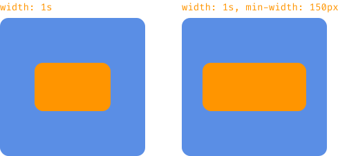
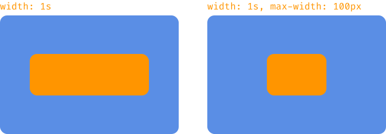
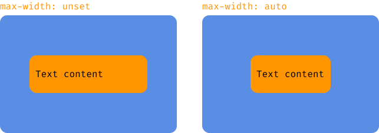

# Constraints

Constraint properties can be used to specify a minimum or maximum value for size or gap.

## Size Constraints

Size constraints can have a value in pixels, a percentage, or auto.

The `min-size` property, which is shorthand for `min_width` and `min_height`, can be used to set a minimum constraint for the size of a view.

The `max-size` property, which is shorthand for `max_width` and `max_height`, can be used to set a maximum constraint for the size of a view.

### Auto min-width/height

An auto `min-width` or `min-height` can be used to specify that a view should not be any smaller than its contents, i.e. the sum or max of its children depending on layout type, in the horizontal or vertical directions respectively.

This is useful in combination with a stretch size, so the view can contract with its parent container but still maintain a minimum size of its content, for example the text of a view.

### Auto max-width/height

An auto `max-width` or `max-height` can be used to specify that a view should not be any larger than its contents, i.e. the sum or max of its children depending on layout type, in the horizontal or vertical directions respectively.

This is useful in combination with a stretch size, so the view can grow with its parent container but no larger than the size of its content.

## Gap Constraints

Gap constraints can have a value in pixels or a percentage.

The `min-gap` property, which is shorthand for `min_horizontal_gap` and `min_vertical_gap`, can be used to set a minimum constraint for the gap between the children of a view. This is particularly useful in combination with a stretch gap, so that the children are evenly distributed but cannot be closer than the minimum gap When the parent container shrinks.

Similarly, the `max-gap` property, which is shorthand for `max_horizontal_gap` and `max_vertical_gap`, can be used to set a maximum constraint for the gap between the children of a view.

